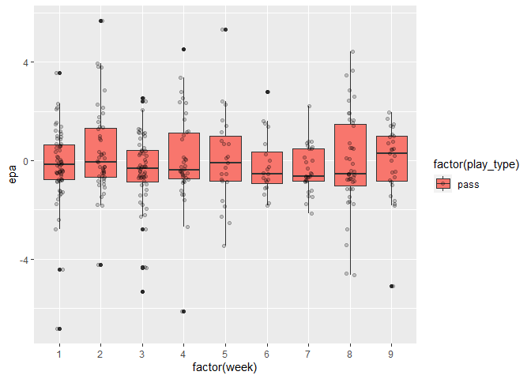
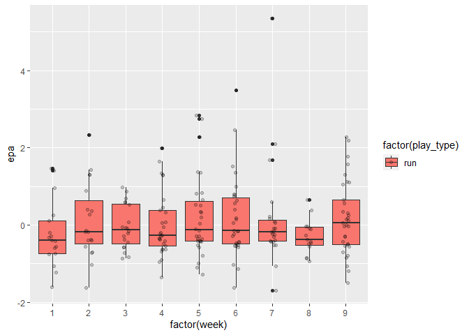

NFL Fast R Beginner Dic
================
Jeffrey Gordon

## Import Libraries

When you click the **Render** button a document will be generated that
includes both content and the output of embedded code. You can embed
code like this:

``` r
library(tidyverse)
```

    ── Attaching packages ─────────────────────────────────────── tidyverse 1.3.2 ──
    ✔ ggplot2 3.3.6      ✔ purrr   0.3.5 
    ✔ tibble  3.1.8      ✔ dplyr   1.0.10
    ✔ tidyr   1.2.1      ✔ stringr 1.4.1 
    ✔ readr   2.1.3      ✔ forcats 0.5.2 
    ── Conflicts ────────────────────────────────────────── tidyverse_conflicts() ──
    ✖ dplyr::filter() masks stats::filter()
    ✖ dplyr::lag()    masks stats::lag()

``` r
library(ggrepel)
library(nflreadr)
library(nflplotR)
options(nflreadr.verbose = FALSE)
```

You can add options to executable code like this

## Basics: How to Look at Your Data

    [1] 48034   372

``` r
str(data[1:10])
```

    nflvrs_d [48,034 × 10] (S3: nflverse_data/tbl_df/tbl/data.table/data.frame)
     $ play_id     : num [1:48034] 1 36 51 79 100 121 148 185 214 239 ...
     $ game_id     : chr [1:48034] "2019_01_ATL_MIN" "2019_01_ATL_MIN" "2019_01_ATL_MIN" "2019_01_ATL_MIN" ...
     $ old_game_id : chr [1:48034] "2019090804" "2019090804" "2019090804" "2019090804" ...
     $ home_team   : chr [1:48034] "MIN" "MIN" "MIN" "MIN" ...
     $ away_team   : chr [1:48034] "ATL" "ATL" "ATL" "ATL" ...
     $ season_type : chr [1:48034] "REG" "REG" "REG" "REG" ...
     $ week        : int [1:48034] 1 1 1 1 1 1 1 1 1 1 ...
     $ posteam     : chr [1:48034] NA "ATL" "ATL" "ATL" ...
     $ posteam_type: chr [1:48034] NA "away" "away" "away" ...
     $ defteam     : chr [1:48034] NA "MIN" "MIN" "MIN" ...
     - attr(*, "nflverse_timestamp")= POSIXct[1:1], format: "2022-09-27 07:19:31"
     - attr(*, "nflverse_type")= chr "play by play data"
     - attr(*, "nflfastR_version")=Classes 'package_version', 'numeric_version'  hidden list of 1
      ..$ : int [1:4] 4 4 0 9010

## Viewer

This function will open the data in a new tab in a tabular view.

``` r
View(data[1:10])
```

## EPA for 2022

``` r
pbp <- load_pbp(2021:2022) %>%
  filter((pass == 1 | rush == 1), season_type == "REG", !is.na(posteam), posteam != "") %>%
  select(play_id, week, season, posteam, pass, defteam, epa)
```

``` r
jets_pbp <- load_pbp(2022) %>%
  filter((play_type == "pass" | play_type =="run"), season_type == "REG", !is.na(posteam), posteam == "NYJ")
```

``` r
view(jets_pbp)
```

``` r
jets_pbp %>%
  filter(play_type == "pass") %>%
  select(play_id, play_type, week, epa) %>%
  ggplot2::ggplot(aes(x = factor(week), y = epa, fill = factor(play_type))) +
  geom_boxplot() + geom_jitter(width=0.1, alpha = 0.2)
```



``` r
jets_pbp %>%
  filter(play_type == "run") %>%
  select(play_id, play_type, week, epa) %>%
  ggplot2::ggplot(aes(x = factor(week), y = epa, fill = factor(play_type))) +
  geom_boxplot() + geom_jitter(width=0.1, alpha = 0.2)
```



## Quarto

Quarto enables you to weave together content and executable code into a
finished document. To learn more about Quarto see <https://quarto.org>.
