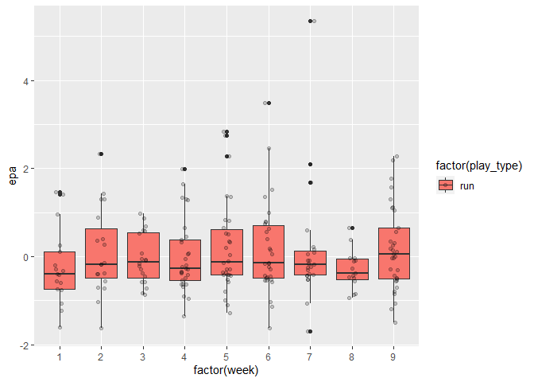

New York Jets Week 9
================
Jeffrey Gordon

    ── Attaching packages ─────────────────────────────────────── tidyverse 1.3.2 ──
    ✔ ggplot2 3.3.6      ✔ purrr   0.3.5 
    ✔ tibble  3.1.8      ✔ dplyr   1.0.10
    ✔ tidyr   1.2.1      ✔ stringr 1.4.1 
    ✔ readr   2.1.3      ✔ forcats 0.5.2 
    ── Conflicts ────────────────────────────────────────── tidyverse_conflicts() ──
    ✖ dplyr::filter() masks stats::filter()
    ✖ dplyr::lag()    masks stats::lag()

I am going to take a look at the progression of expected points added
over the course of the season for the New York Jets offense. I want to
break the season into two known chunks: quarterback at the time, and
main running back.


    # A tibble: 2 × 10
    # Groups:   play_type [2]
      play_type   `1`   `2`   `3`   `4`   `5`   `6`   `7`   `8`   `9`
      <chr>     <int> <int> <int> <int> <int> <int> <int> <int> <int>
    1 pass         62    47    56    38    23    20    29    43    27
    2 run          17    19    20    29    30    30    23    15    33

As of the end of week 9 of the 2022 season, the New York Jets have run
561 offensive plays classified as a run or pass according to the
nflfastR play-by-play data.

# EPA

What I want to explore next has to do with expected points added (EPA).
For more information on how this is calculated you can visit:

- [nflWAR: A Reproducible Method for Offensive Player Evaluation in
  Football (Extended Edition)](https://arxiv.org/pdf/1802.00998.pdf)

- [Calibration for nflfastR models (including expected
  points)](https://www.opensourcefootball.com/posts/2020-09-28-nflfastr-ep-wp-and-cp-models/#ep-model-features)

I am going to explore the changing expected points over the course of
the season.

``` r
jets_pbp %>%
  filter(play_type == "pass") %>%
  select(play_id, play_type, week, epa) %>%
  ggplot2::ggplot(aes(x = factor(week), y = epa, fill = factor(play_type))) +
  geom_boxplot() + geom_jitter(width=0.1, alpha = 0.2) + theme_few()
```


``` r
jets_pbp %>%
  filter(play_type == "run") %>%
  select(play_id, play_type, week, epa) %>%
  ggplot2::ggplot(aes(x = factor(week), y = epa, fill = factor(play_type))) +
  geom_boxplot() + geom_jitter(width=0.1, alpha = 0.2)
```



## Citations

Carl S, Baldwin B (2022). *nflfastR: Functions to Efficiently Access NFL
Play by Play Data*. https://www.nflfastr.com/,
https://github.com/nflverse/nflfastR.
